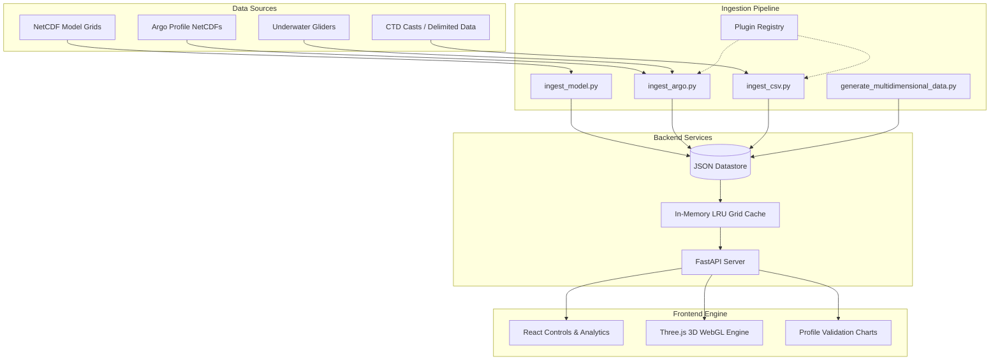

# AQUA-VIS: 3D Ocean Visualization Platform

AQUA-VIS is an interactive, web-based 3D digital twin platform designed for **INCOIS (Indian National Centre for Ocean Information Services)**, Ministry of Earth Sciences, to seamlessly fuse numerical ocean model outputs with in-situ observational networks (Argo floats, gliders, and CTD casts).

---

## Key Capabilities & Enhancements

1. **True 3D Volumetric Depth Slicing**: Slices through 9 standardized oceanic depth levels from the sea surface (`0.49m`) through the thermocline (`50m–200m`) down to the abyssal ocean (`2000m`).
2. **4D Temporal Forecast Playback**: Animate ocean currents (`uo`, `vo`), sea surface temperature (`thetao`), and salinity (`so`) across daily forecast intervals.
3. **Real-Time Model vs. In-Situ Discrepancy Engine**: 
   - Dynamically calculates difference: $\Delta T = T_{\text{observed}} - T_{\text{model}}$.
   - Renders visual 3D radar beacons and pulsating halos on the globe:
     - 🟢 **Agreement (<0.5°C)**
     - 🟡 **Moderate Divergence (0.5°C–1.5°C)**
     - 🔴 **High Forecast Drift (>1.5°C)**
4. **Dual-Curve In-Situ Validation**: Clicking any float renders dual-line profiles comparing real-world observation curves with numerical model curves across depths.
5. **Regional Camera Presets**: One-click smooth orbital navigation targeting:
   - 🇮🇳 **Indian Ocean & Exclusive Economic Zone (EEZ)**
   - 🌊 **Arabian Sea Upwelling Basin**
   - 🌀 **Bay of Bengal Freshwater Plume & Cyclone Basin**
   - 🌐 **Global Basin Overview**
6. **Drag & Drop NetCDF/CSV Ingestion Modal**: Ingest new Copernicus NetCDF (`.nc`), Argo floats (`R*.nc`), and research vessel CSV files with automatic pipeline triggering.

---

## UN Sustainable Development Goals (SDGs) Alignment

| Goal | Target | Alignment in AQUA-VIS |
| :--- | :--- | :--- |
| **SDG 14: Life Below Water** | 14.1 & 14.3 | Real-time monitoring of ocean heat waves, thermocline depth shifts, and salinity variations affecting marine ecosystems. |
| **SDG 13: Climate Action** | 13.1 | Faster calibration of ocean forecast models used for cyclone intensity prediction and monsoon monitoring. |
| **SDG 9: Industry, Innovation & Infrastructure** | 9.5 | Sovereign, open-source browser-based digital twin infrastructure for Indian scientific institutions. |

---

## System Architecture



---

## API Reference

The FastAPI backend exposes the following REST endpoints:

- `GET /api/health`: System health, version, and active data directory.
- `GET /api/variables`: Available model variables (thetao, so, uo, vo), 9 depth levels, and 7 forecast timestamps.
- `GET /api/grid?variable={var}&depth={depth}&time={time}`: Sub-10ms cached 2D slice for volumetric rendering.
- `GET /api/point_data?lat={lat}&lon={lon}&variable={var}&depth={depth}|time={time}`: Fast nearest-coordinate time-series or depth profiles.
- `GET /api/instruments`: Geospatial positions, regions, biases, and discrepancy statuses of registered in-situ instruments.
- `GET /api/instruments/{id}/profile`: Complete observed vs model depth-profile data down to 2000m.
- `GET /api/discrepancy/summary`: Fleet-wide discrepancy metrics (active float count, model agreement percentage, mean bias).
- `POST /api/upload`: Multipart upload for NetCDF (.nc) or CSV (.csv, .txt) files.

---

## Deployment Guide

The application is containerized using a multi-stage Docker build.

1. Build the Docker image:
   ```bash
   docker build -t aqua-vis .
   ```
2. Run the container:
   ```bash
   docker run -p 8000:8000 aqua-vis
   ```
3. Open `http://localhost:8000` in your browser.
